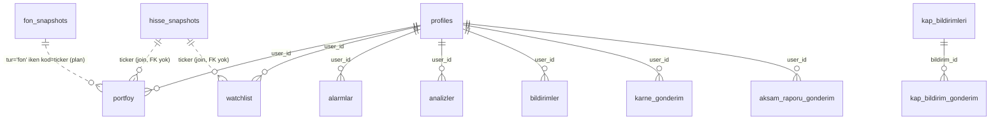

# Hisse Sistemi Mimarisi — Referans Envanteri

**Tarih:** 15 Temmuz 2026 · **Amaç:** Kıymetli madenler modülü planının ([[kiymetli-madenler-plan]]) temeli — hisse (BIST) sisteminin uçtan uca haritası. Kod okuması `main @ 7d62d8b` üzerinde yapıldı.

---

## 1. Veritabanı şeması

Tek migration dosyası: `supabase/migrations.sql` (idempotent, Supabase SQL Editor'de MANUEL koşulur — otomatik runner yok; bkz. [[kap-tercumani-supabase-semasi]] işleyiş notları).

| Tablo | Rol | Kritik alanlar |
|---|---|---|
| `hisse_snapshots` | Fiyat cache'i (cron yazar, herkes okur) | ticker PK-vari, fiyat, degisim_yuzde, hacim, piyasa_degeri, getiri_1h/1a/3a/1y, updated_at. RLS: herkes SELECT, yazma service role |
| `portfoy` | Pozisyonlar | user_id, ticker, adet, maliyet, alis_tarihi, **tur** (`hisse`\|`fon` CHECK — Faz 4'te eklendi, yeni varlık sınıfı için genişletilebilir) |
| `watchlist` | İzleme | user_id, ticker, added_at |
| `alarmlar` | Fiyat/yüzde/gösterge alarmları | ticker TEXT, tip (fiyat_seviye/fiyat_yuzde/yuzde_degisim/gosterge), kosul (yukari/asagi), hedef_deger, hedef_yuzde, gosterge_tipi/esik, durum ([migrations.sql:187](../../supabase/migrations.sql)) — ⛔ [[faz4-alarm-cron-donduruldu]] |
| `analizler` | AI analiz cache'i (kullanıcı×ticker tek satır) | user_id, ticker, analiz TEXT, created_at |
| `bildirimler` | In-app bildirim | baslik, aciklama, detay, tip, ikon, okundu |
| `kap_bildirimleri` (+gonderim, +cursor) | KAP boru hattı | disclosure_index UNIQUE, tickerlar TEXT[] GIN — hisseye özel |
| `fon_snapshots` | **İkinci varlık sınıfı emsali** (Kaan) | kod PK, fiyat, gunluk_getiri, getiri_1a..5y, risk_degeri, portfoy_buyukluk, yonetim_ucreti |
| `karne_gonderim`, `aksam_raporu_gonderim` | E-posta idempotency | UNIQUE(user_id, hafta/gun) insert-then-check |
| `risk_profil` | Kullanıcı risk anketi | vade, risk_toleransi, sermaye, sektor, ai_oneri JSON |

Fiyat geçmişi tablosu YOK — geçmiş her seferinde Yahoo chart API'sinden çekilir (grafik/getiri hesapları), yalnız güncel kesit `hisse_snapshots`'ta.

## 2. Sayfa/route yapısı

- `app/hisseler/page.tsx` — liste; **`?varlik=fon` query param'ıyla sekmeleşmiş** (satır 147: `varlik === "fon" ? ... : "hisse"`) → üçüncü varlık sınıfı için hazır desen. Tablo/ısı haritası görünümleri, server-side sayfalama (`/api/hisseler`).
- `app/hisse/[ticker]/page.tsx` (client, ~660 satır) — fiyat kartı, OHLC, grafik (range'ler), risk kartı ("Neden bu skor?" dahil), AI analiz, Pako chatbot, izleme yıldızı, 15 sn `/api/hisse-ozet` polling'i.
- `app/hisse/[ticker]/layout.tsx` (56 satır, server) — `generateMetadata` (title/description/canonical/OG) + pilot hisselere Corporation JSON-LD (`lib/seo-pilot-hisseler.ts`).
- Fon emsali: `app/fon/[kod]/page.tsx` + `layout.tsx` + `loading.tsx` — aynı detay-sayfası deseni ikinci varlık için nasıl kopyalanır, canlı örneği.

## 3. Component'ler

**Doğrudan reuse edilebilir (varlık-bağımsız):** `components/ui/Toast`, `ui/SkeletonCard`, `ui/ErrorBoundary`, `StockLogo` (fallback: ilk 3 harf + deterministik renk — maden ikonu için de çalışır), `AppShell` (nav item eklenir), `lib/design-tokens`, `lib/formatters` (formatCurrency/Percent/Quantity), `hooks/useSession`, `hooks/useMediaQuery`.

**Hisseye özel ama deseni kopyalanabilir:** `HisseGrafik` (recharts sarmalayıcı — veri şekli `{tarih, fiyat}[]`, varlık-bağımsız aslında; sadece props), `AlarmModal` (⛔ dondurulmuş), `HisseChatbot` (ticker bağlamlı), `DashboardMarketFocus` (mover+chip), `RiskProfilWidget`.

**Util/lib reuse:** `lib/market-pricing.ts` `fetchMarketQuote` — Yahoo chart soyutlaması AMA `yahooUrl()` `.IS` suffix'ini hardcode ediyor (satır ~37) → maden sembolleri için parametrizasyon gerekir. `lib/rate-limit`, `lib/hata-yakala`, `lib/karne` (değer-ağırlıklı hesap çekirdeği), `lib/risk-hesaplari` (saf fonksiyonlar; 21 birim testli).

## 4. Veri kaynağı ve fetch

- **Yahoo Finance** tek fiyat kaynağı (truncgil koddan tamamen çıkarılmış — CLAUDE.md referansı bayat): `query1.finance.yahoo.com/v8/finance/chart/{SEMBOL}` deseni 4 yerde (`market-pricing`, `piyasa`, `grafik`, `risk`, `karne`). 15 dk gecikmeli etiketi UI'da.
- `/api/piyasa` — USDTRY=X, EURTRY=X, XU100, XU030 (3 sn in-memory cache). **Altın/gümüş şu an YOK.**
- `/api/grafik` — `?ticker=X&range=` ; `.IS` suffix'ini `=X` ile bitmeyenlere ekler (satır 37: `ticker.endsWith(".IS") || ticker.endsWith("=X") ? ticker : ticker+".IS"`) → `GC=F` gibi futures sembolleri için genişletme gerekir.
- **Cron:** `.github/workflows/hisse-snapshot-cron.yml` */5 dk → `/api/cron/hisse-snapshot` (CRON_SECRET Bearer) → 25'li batch'lerle 606 hisse Yahoo fetch → `hisse_snapshots` upsert → yanıtta `hata` sayacı (workflow `"hata":[1-9]` grep'iyle kırmızıya düşer). Fon emsali: `fon-snapshot-cron.yml` günlük 19:30.

## 5. Price alert sistemi ⛔

`/api/alarmlar` CRUD (Bearer) → `alarmlar` tablosu → `.github/workflows/alarm-cron.yml` (15 dk) → `/api/cron/alarmlar`: aktif alarmları çek, `/api/fiyatlar`+`/api/risk`(RSI) ile karşılaştır, atomic claim (`UPDATE ... WHERE durum='aktif'`), `bildirimler` insert + Resend e-posta. **[[faz4-alarm-cron-donduruldu]] — ikinci emre kadar bu sisteme hiçbir iş yapılmaz; maden planındaki alert bölümü de dondurma kapsamında.**

## 6. Portföy entegrasyonu

`portfoy` tablosuna client'tan doğrudan Supabase insert (RLS own_all). Hesaplar: değer = adet×snapshot.fiyat; kar/zarar = (fiyat−maliyet)×adet (portföy sayfası); değer-ağırlıklı getiri/risk/beta `lib/karne.karneHesapla`; gün sonu atıf `cron/aksam-raporu`. `tur` kolonu fon için eklendi ama **fon UI'ı henüz bağlanmadı** ([[faz4-gorev21-fon-karnesi-hazirlik]]) — maden da aynı bekleyen desene ekleneceK.

## 7. AI commentary

- `/api/analiz` — claude-sonnet-4-6; `kisaYorum:true` (dashboard 2-3 cümle) / false (4 bölüm: Şirket Profili, Finansal Durum, Piyasa Konumu, Dikkat Noktaları — **bölüm adları hisse-özgü**); kullanıcı başına saatte 10 (Supabase rate limit); sonuç `analizler`'e yazılır, "Son analiz" rozeti okur; makro risk bloğu prompt'a enjekte (`lib/macro-risk.macroRiskPromptBlock`).
- Pako chatbot `/api/chatbot` — 6 tool (get_hisse_fiyat, get_teknik_analiz, get_kap_haberler, get_genel_piyasa, get_portfoy, search_hisse); SSE status event'leri; SPK yasaklı-ifade filtresi + `cevabiTemizle`.
- Subagent'lar (`.claude/agents/`): `data-pipeline` (veri entegrasyonu), `kap-explainer` (anlatım/SPK üslubu — hisse değil KAP odaklı), `supabase-schema` (şema kararları). Maden şeması için supabase-schema, veri kaynağı için data-pipeline kullanılır.

## 8. SEO

- `app/sitemap.ts` — statik sayfalar + 607 `/hisse/[ticker]` + son 500 `/kap/*`. **Fon sayfaları sitemap'te YOK** (Kaan eklememiş — maden planında ders: sitemap unutulmasın, fon için de açık iş).
- `hisse/[ticker]/layout.tsx` generateMetadata + 50 pilot hisseye Corporation JSON-LD.
- `/kap` ISR sayfaları (revalidate 900/1800) programatik SEO'nun ana motoru (içerik A.1 fix'ini bekliyor).

## 9. Risk profili quiz'i

`risk_profil` tablosu + `RiskProfilWidget` (dashboard sağ panel) + `/api/risk-profil` (SPK "tarama asistanı" framing'li AI öneri). **Hisselerle doğrudan bağ yok** — öneri çıktısı serbest metin; hisse detay/liste sayfaları risk_profil okumuyor. Maden için de bağımlılık yok (nötr).

---

## Şema ilişki haritası

Not: ticker ilişkileri FK'sız serbest join — snapshot tablosu evrenin dışındaki ticker'ı sessizce boş döndürür. Maden için aynı gevşek bağ yeterli.

## Hisseye özel — madene DOĞRUDAN uymayacak noktalar

1. **KAP katmanı** (bildirim, tercüman, chip, SEO içeriği) — madenin karşılığı yok. Muadili ileride makro haber akışı olabilir; v1 kapsam dışı.
2. **Piyasa değeri / F-K / PD-DD / TradingView scanner** — emtiada anlamsız; risk motorunun bu bileşenleri madende sıfır ağırlık olmalı.
3. **Beta (XU100'e karşı)** — altının BIST betası anlamlı bir "risk" ölçüsü değil; volatilite/momentum/RSI uyarlanır, beta ya USDTRY'ye karşı yeniden tanımlanır ya atılır.
4. **`market-pricing.yahooUrl` `.IS` hardcode'u** ve `grafik/route.ts` suffix mantığı — futures sembolleri (`GC=F`) için genişletme ister.
5. **Hacim/likidite faktörleri** — Yahoo futures hacmi COMEX kontrat hacmidir, TL piyasası likiditesini temsil etmez; UI'da "hacim" kartı madende gizlenmeli/yeniden etiketlenmeli.
6. **AI analiz bölüm başlıkları** ("Şirket Profili"...) — maden için ayrı prompt şablonu gerekir.
7. **Sektör/bist-companies.json** — maden evreni ayrı, küçük, statik bir listedir (data/ altında ayrı dosya).
8. **Bedelsiz/temettü düzeltmeleri** (`kurumsalAksiyonlariAyarla`, adjclose mantığı) — emtiada kurumsal aksiyon yok; bu kod yolları madene taşınmaz.
